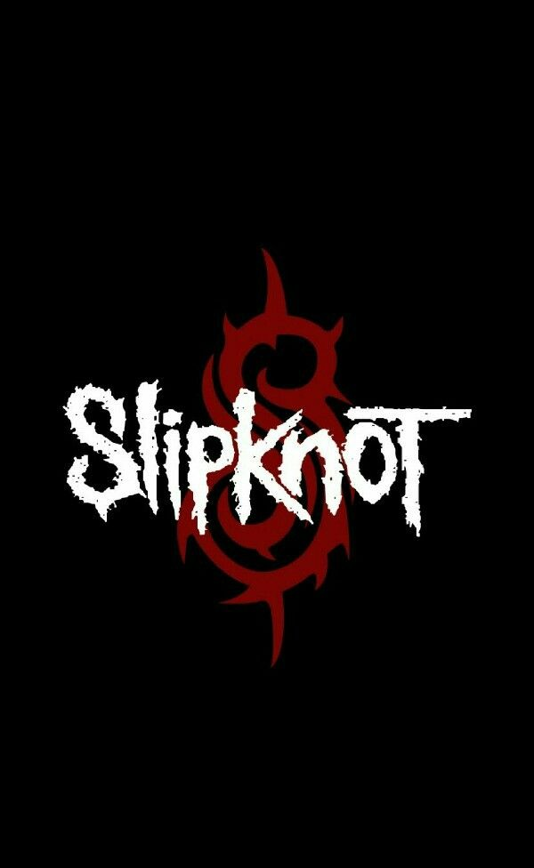

# Slipknot Fan Page

Este é um projeto de página de fãs da banda Slipknot. A página inclui informações sobre os integrantes da banda, links para redes sociais e uma seção de história da banda.

## Visão Geral



A página contém:

- Ícones de redes sociais com links para perfis oficiais da banda.
- Um logo centralizado e estilizado da banda Slipknot.
- Uma galeria de imagens dos integrantes da banda com links para seus perfis no Instagram.
- Uma seção de história detalhada da banda.

## Tecnologias Usadas

- React.js
- Font Awesome para ícones de redes sociais
- CSS para estilização

## Instalação

Para rodar o projeto localmente, siga os passos abaixo:

1. Clone o repositório:
    ```bash
    git clone https://github.com/seu-usuario/slipknot-fan-page.git
    cd slipknot-fan-page
    ```

2. Instale as dependências:
    ```bash
    npm install
    ```

3. Inicie o servidor de desenvolvimento:
    ```bash
    npm start
    ```

4. Abra o navegador e vá para `http://localhost:3000`.

## Estrutura do Projeto

meu-projeto/
├── node_modules/
├── public/
│ ├── img/
│ │ ├── alessandro.jpg
│ │ ├── Corey.jpg
│ │ ├── eloy.webp
│ │ ├── favicon.ico
│ │ ├── jin root.jpg
│ │ ├── logo.jpg
│ │ ├── michael.jpg
│ │ ├── mick.avif
│ │ ├── shawn.jpg
│ │ ├── sid wilson.jpg
│ │ └── website slipknot.jpeg
│ ├── style.css
│ ├── index.html
│ ├── favicon.ico
│ └── manifest.json
├── src/
│ ├── App.css
│ ├── App.js
│ ├── Header.js
│ ├── Header.css
│ ├── index.css
│ ├── index.js
├── .gitignore
├── package.json
├── README.md


## Como Contribuir

Se você quiser contribuir para o projeto, siga as instruções abaixo:

1. Faça um fork do projeto.
2. Crie uma branch para sua feature:
    ```bash
    git checkout -b minha-nova-feature
    ```
3. Commit suas mudanças:
    ```bash
    git commit -m 'Adiciona minha nova feature'
    ```
4. Envie para o repositório remoto:
    ```bash
    git push origin minha-nova-feature
    ```
5. Crie um Pull Request.

## Contato

Se você tiver alguma dúvida ou sugestão, entre em contato pelo [e-mail](brunnavillanova@gmail.com).

## Licença

Este projeto está licenciado sob a Licença MIT. Veja o arquivo [LICENSE](LICENSE) para mais detalhes.